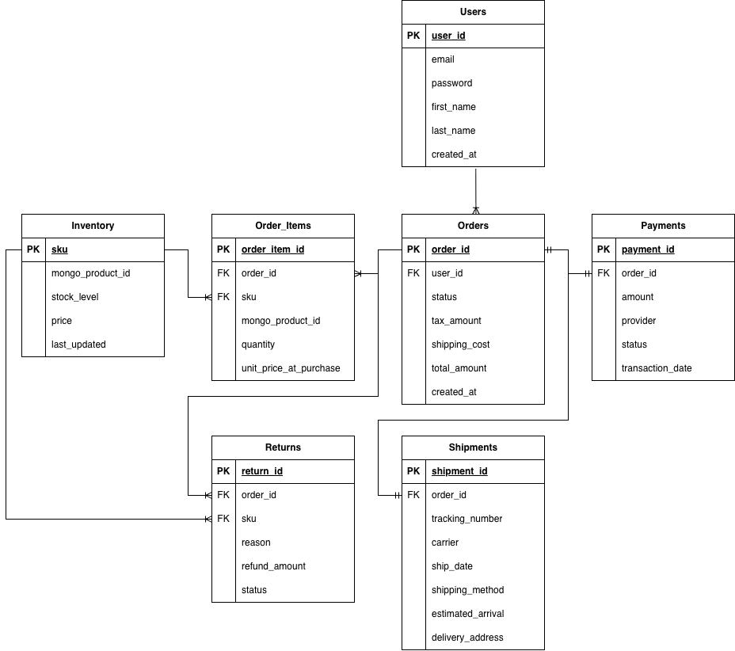
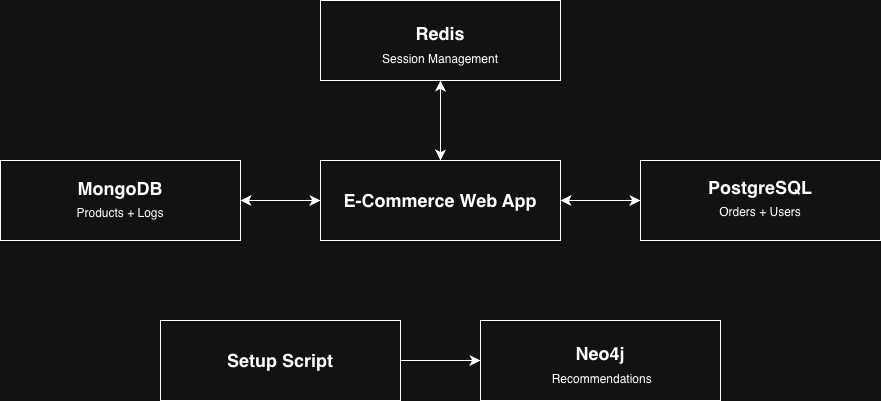

# MPCS Databases Final Project
### Spencer Dearman & Grace Lu
Spencer worked on MongoDB, Redis, and Neo4j components. Grace worked on PostgreSQL components and the ERD. We collaborated in person to put everything together and write up our responses to the Database Design questions. In addition, we were under the impression that we would have to implement the entire database scheme instead of just the queries, so we implemented the entire database scheme. 

### *Note: You need Docker to run this project.*

# Setup

### Initial Commands
1. Run `chmod +x setup.sh`
2. Run `./setup.sh`

### Running Queries
1. Full Output: `python3 queries.py --export output.txt` to get the full output of the queries without limits.
2. Limited Output: `python3 queries.py` to get the limited output of the queries.

# Resources
### Data Generation
1. User-Events: https://gemini.google.com/share/000057595518 - This was a good start but we had to update the generic data to be more realistic with links to specific categories and products. We also had to change the user ID range to match the 1000 user limit. Overall it was a good foundation but needed some changes to be more accurate.
2. Orders: https://gemini.google.com/share/600de4cc1ff1 - The generated output from Gemini initially tried to create new tables, but we changed it to instead use our existing tables. We also changed the Order-Items insertion to reference the sku instead of using the Postgres int ID. We also added a returns section so that the script will also generate corresponding return events. Again, Gemini was a good start but to accurately hit all of the requirements, we had to make some changes.
3. Products: https://gemini.google.com/share/a064707c28b6 - We increased NUM_PRODUCTS from 5,000 to 10,000 to match the 10,000 product limit. Other than that, we didn't have to make too many changes, and I think that this makes sense because having Gemini create fake product data is fairly straightforward for an LLM.
4. Sessions: https://gemini.google.com/share/4b1fd1f88388 - The main change is that we changed the fake data to just select a product using a random integer instead of loading in the products file to simplify the sessions data. Again, Gemini is a good tool but it needed some modifications to be more accurate.

### General Sources
1. https://www.psycopg.org/docs/usage.html: Used this adapter so that we could use PostgreSQL with python.
2. https://www.mongodb.com/docs/languages/python/pymongo-driver/current/: Used Pymongo so that we could connect with the MongoDB using python.


# Database Design Questions

### 1. Database Types & Justification

| Functionality | Database Type | Justification |
|---------------|---------------|---------------|
| **User Accounts & Orders** | Relational (PostgreSQL) | We chose a relational DB because financial data needs to be accurate and easy to access. In addition, it is more straightforward to join users with their order history. |
| **Inventory** | Relational (PostgreSQL) | We need to make sure we don't sell the same item twice. Postgres transactions handle that concurrency for us. |
| **Payments** | Relational (PostgreSQL) | Crucial for ensuring a user isn't charged if the order fails halfway through. If the server crashes, the transaction rolls back. |
| **Shipments & Returns** | Relational (PostgreSQL) | These have clear stages (shipped, delivered, returned) that fit well into a structured table with timestamps. |
| **Product Catalog** | Document (MongoDB) | MongoDB lets us store whatever attributes we need for each item, whereas Postgres wouldn't allow us to store variant attributes without a lot of extra NULL fields. |
| **User Behavior Logs** | Document (MongoDB) | This generates a massive amount of data very quickly. MongoDB handles high write speeds better, and we can just dump the event JSON in without worrying about schema. |
| **Session/Cart Management** | Key-Value (Redis) | We need the shopping cart to load instantly. Redis keeps it in memory so it's much faster than querying from the disk. |
| **Recommendations** | Graph (Neo4j) | Determining which users bought and X and also Y is really slow with SQL joins, but is a lot faster using a graph structure. |

### 2. ERD


**Tables:**
- `Users`: user_id (PK), email, password, first_name, last_name, created_at
- `Orders`: order_id (PK), user_id (FK), status, tax_amount, shipping_cost, total_amount, created_at
- `Order_Items`: order_item_id (PK), order_id (FK), sku (FK), mongo_product_id, quantity, unit_price_at_purchase
- `Inventory`: sku (PK), mongo_product_id, stock_level, price, last_updated
- `Shipments`: shipment_id (PK), order_id (FK), tracking_number, carrier, ship_date, shipping_method, estimated_arrival, delivery_address
- `Payments`: payment_id (PK), order_id (FK), amount, provider, status, transaction_date
- `Returns`: return_id (PK), order_id (FK), sku (FK), reason, refund_amount, status

### 3. Handling Unique Product Attributes
We use MongoDB for the products. This allows us to store all of the core fields (name, price, sku) at the top level, and a flexible `attributes` sub-document for category-specific fields (e.g., `size`, `color` for clothes; `storage`, `ram` for electronics). This avoids tables with a lot of NULL columns in a relational DB. 

For example, headphones are in the electronics category, so they have attributes like battery life, connectivity type, and weight. On the other hand, dresses are apparel, and they have variants like S-Aqua, M-Aqua, and L-Aqua. 

### 4. Session Management
**Active Sessions:** Stored in Redis so we can read/write specific fields without serializing/deserializing the entire object every time. Key: `cart:{session_id}`. Value: Hash containing `user_id`, `items` (JSON), `last_active`.

**Persistence:** On checkout, data is moved to PostgreSQL (Orders). Once a session expires, the data can be discarded or archived.

**Cross-Device Management:** When a user logs in, we look up their active session in Redis using a mapping `user:{user_id}:active_session` -> `session_id` or by querying the cart hash.

### 5. Denormalization & Trade-offs
We store the `product_name` and `unit_price_at_purchase` in the `Order_Items` table in PostgreSQL.
- We do this so that if a product name or price changes later, then the order record should reflect the state at the time of purchase. Without denormalization, this would require a more complicated join across three systems: Orders (SQL) $\to$ Order_Items (SQL) $\to$ Product_Catalog (MongoDB). By storing the name directly in Order_Items, we eliminate the need to query MongoDB just to list the line items.
- **Trade-offs:**
    - *Storage:* Increased storage due to duplication in exchange for reduced CPU load.
    - *Consistency:* Data is stale relative to the catalog, but correct for the historical record.
    - *Read Performance:* Faster reads for order history as no join with the Product table is needed for basic details. We are sacrificing a tiny amount of write speed for a massive gain in read speed.

### 6. Data Flow Diagram


**Data Freshness:**
- **Redis:** Real-time.
- **Postgres/Mongo:** Real-time for transactional data.
- **Neo4j:** Updated on every load / setup.

### 7. Challenges & Mitigation
**Challenges:** 
- Data consistency between Redis (Cart) and Postgres (Inventory). For example, one user adds an item to their cart when Redis says "In Stock." Several days later, they try to check out and Postgres says "Out of Stock."
- Data consistency between MongoDB and Postgres for products that have been renamed. This creates confusion when querying by item name.

**Mitigation:** 
- We will check the stock in Postgres only at the checkout step, which allows the cart to potentially hold out-of-stock items until the final moment to maximize the performance. For example, multiple people can have an item in their carts, even if there are not actually enough in Inventory. The first people to actually check out will be the only ones able to actually purchase them.
- Use SKUs for querying to avoid potential confusion from renamed items, or establish source of truth (i.e. Postgres is the source of truth for inventory and financial information, and MongoDB is only the source of truth for descriptive content).

### 8. In-Memory Storage (Redis)
**Usage:** Sessions (shopping carts).
**Consistency:** We use Redis as the source of truth for sessions, which enable us to access active carts. It does not need to sync with Postgres until an Order is placed. If the server crashes, session data is lost.

### 9. User Behavior Tracking
Since user behavior data is going to be high volume and require a lot of writes, we used MongoDB to store it because it has a better tolerance for data loss. 

**Structure:** 
- User actions (e.g., clicking a product, performing a search, adding an item to cart) are captured as JSON documents and written directly to the `user_events` collection in MongoDB. This ensures that the main application flow (like page loads) aren't going to be blocked by logging operations.

**Schema:** 
- A single collection `user_events` with a general `details` field, structure dependent on `event_type`
- Base schema: `{ event_id, user_id, session_id, event_type (view, click, search), timestamp, details: {} }`

**Usage:**
- We query this collection to show users their recently viewed products (Query 2) and recent search terms (Query 6).
- We aggregate this data to determine the most popular products based on views (Query 5) and to calculate cart abandonment rates (Query 11).

### 10. Graph Database (Neo4j)
A graph database is better for queries that require traversing between nodes. For example, if you are trying to find the shortest path, or if you are trying to find the products that are usually purchased with a specific product, then a graph database is better than a relational database.

**Model:**
- Nodes: `User`, `Product`
- Relationships: `(:User)-[:BOUGHT]->(:Product)`, `(:User)-[:VIEWED]->(:Product)`

# Revision Log

### Revision 1
- **Component being revised:** Session management
- **Changes made:** We implemented session management in Redis after learning about Redis in class.
- **Rationale:** We were initially unsure about how to handle sesion management in PostgreSQL since using a CartItems table creates unnecessary I/O overhead. Redis is more suitable for storing active shopping carts and session data since its in-memory speed excels at high-frequency read/writes with temporary data.
- **Date:** 11/15

### Revision 2
- **Component being revised:** Product catalog
- **Changes made:** Migrated product catalog from PostgreSQL to MongoDB (products table -> products collection).
- **Rationale:** The rigid schema of PostgreSQL was very inefficient for handling the diverse product attributes across different categories (ex: fashion vs electronics). After learning about document databases like MongoDB that are better suited for handling flexible bucket attributes, we revised our product catalog over instead of needing complex entity-attribute-value tables.
- **Date:** 11/18

### Revision 3
- **Component being revised:** User Activity Analytics
- **Changes made:** Transitioned from parsing raw text logs to using MongoDB for structured event data in the user_events collection.`
- **Rationale:** We wanted to better suppoprt real-time analytics (i.e. recent views in query 2, cart abandonment rates in query 11). Storing these events as JSON documents in MongoDB allows for superior querying and aggregation that would be much slower with flat text files.
- **Date:** 11/20

### Revision 4
- **Component being revised:** Shipping logic 
- **Changes made:** Decoupled shipping logic into separate Shipments table instead of as status columns in the Orders table.
- **Rationale:** We realized an order's payment status and physical shipping status are two distinct lifecylces. Separating shipping into a separate table lets us handle cases like when an order is paid but pending shipment or when there are multiple shipments per order.
- **Date:** 11/22

### Revision 5
- **Component being revised:** Recommendation engine
- **Changes made:** Adopted Neo4j instead of relying on SQL self-joins for **frequently bought together** logic.
- **Rationale:** Neo4j graphs are much more efficient at traversing to find related items in constant time relative to depth rather than total table size. SQL queries were becoming exponentially more expensive as the dataset increased in size.
- **Date:** 11/25

# Queries
### **See full query script in [queries.py](queries.py)**

```python
def query_1(limit=50):
    print("\nquery 1: retrieve all 'fashion' products with attributes")
    db = get_mongo_db()
    pipeline = [
        {"$match": {"category": "Fashion"}},
        {"$project": {"name": 1, "attributes": 1, "variants": 1}}
    ]
    
    results = list(db.products.aggregate(pipeline))
    display_results = results[:limit] if limit else results
    for p in display_results:
        print(f"product: {p.get('name')}, attributes: {p.get('attributes')}")
    print(f"(total {len(results)} items found)")

def query_2(user_id, limit=50):
    print(f"\nquery 2: last {limit if limit else 'all'} products viewed by sarah")
    db = get_mongo_db()
    six_months_ago = (datetime.utcnow() - timedelta(days=180)).strftime("%Y-%m-%dT%H:%M:%SZ")
    
    cursor = db.user_events.find(
        {
            "user_id": user_id, 
            "event_type": "view_product",
            "timestamp": {"$gte": six_months_ago}
        },
        {"details.product_id": 1, "timestamp": 1}
    ).sort("timestamp", -1)
    
    if limit:
        cursor = cursor.limit(limit)
        
    results = list(cursor)
    for r in results:
        print(f"viewed: {r['details'].get('product_id')} at {r['timestamp']}")

def query_3(limit=50):
    print("\nquery 3: check current stock level (low stock < 5)")
    conn = get_pg_conn()
    cur = conn.cursor()
    limit_clause = f"LIMIT {limit}" if limit else ""
    cur.execute(f"""
        SELECT sku, stock_level FROM Inventory 
        WHERE stock_level < 5 {limit_clause};
    """)
    for row in cur.fetchall():
        print(f"low stock warning: sku {row[0]} has only {row[1]} left.")
    conn.close()

def query_4(limit=50):
    print("\nquery 4: fashion products (blue or large)")
    db = get_mongo_db()
    query = {
        "category": "Fashion",
        "$or": [
            {"variants.color": "Blue"},
            {"variants.size": "L"},
            {"attributes.size": "L"}
        ]
    }
    results = list(db.products.find(query))
    display_results = results[:limit] if limit else results
    for p in display_results:
        print(f"product: {p.get('name')}, attributes: {p.get('attributes')}")
    
    count = db.products.count_documents(query)
    print(f"found {count} products matching criteria.")

def query_5(limit=50):
    print("\nquery 5: product page views (ordered by popularity)")
    db = get_mongo_db()
    pipeline = [
        {"$match": {"event_type": "view_product"}},
        {"$group": {"_id": "$details.product_id", "views": {"$sum": 1}}},
        {"$sort": {"views": -1}}
    ]
    if limit:
        pipeline.append({"$limit": limit})
    
    results = list(db.user_events.aggregate(pipeline))
    for r in results:
        print(f"product {r['_id']}: {r['views']} views")

def query_6(user_id, limit=50):
    print(f"\nquery 6: recent search terms for sarah (frequency & time of day)")
    db = get_mongo_db()
    pipeline = [
        {"$match": {"user_id": user_id, "event_type": "search"}},
        {"$project": {
            "query": "$details.query",
            "hour": {"$hour": {"$dateFromString": {"dateString": "$timestamp"}}}
        }},
        {"$project": {
            "query": 1,
            "time_of_day": {
                "$switch": {
                    "branches": [
                        {"case": {"$and": [{"$gte": ["$hour", 5]}, {"$lt": ["$hour", 12]}]}, "then": "Morning"},
                        {"case": {"$and": [{"$gte": ["$hour", 12]}, {"$lt": ["$hour", 17]}]}, "then": "Afternoon"},
                        {"case": {"$and": [{"$gte": ["$hour", 17]}, {"$lt": ["$hour", 21]}]}, "then": "Evening"}
                    ],
                    "default": "Night"
                }
            }
        }},
        {"$group": {
            "_id": {"query": "$query", "tod": "$time_of_day"},
            "count": {"$sum": 1}
        }},
        {"$sort": {"count": -1}}
    ]
    
    if limit:
        pipeline.append({"$limit": limit})
    results = list(db.user_events.aggregate(pipeline))
    for r in results:
        print(f"term: '{r['_id']['query']}', time: {r['_id']['tod']}, count: {r['count']}")

def query_7(limit=50):
    print("\nquery 7: fetch all carts (from redis)")
    r = get_redis_client()
    keys = list(r.scan_iter("cart:*"))
    print(f"total active carts in redis: {len(keys)}")
    
    display_keys = keys[:limit] if limit else keys
    for key in display_keys:
        cart = r.hgetall(key)
        items = json.loads(cart.get("items", "[]"))
        item_count = sum(item['quantity'] for item in items)
        
        print(f"cart ({key}): user {cart.get('user_id')} on {cart.get('device')} has {item_count} items. total: ${cart.get('total_amount')}")

def query_8(user_id, limit=50):
    print(f"\nquery 8: retrieve all orders for sarah")
    conn = get_pg_conn()
    cur = conn.cursor()
    limit_clause = f"LIMIT {limit}" if limit else ""
    query = f"""
        SELECT o.order_id, o.status, o.total_amount, s.shipping_method
        FROM Orders o LEFT JOIN Shipments s ON o.order_id = s.order_id
        WHERE o.user_id = %s {limit_clause};
    """
    cur.execute(query, (user_id,))
    rows = cur.fetchall()
    for r in rows:
        print(f"order {r[0]}: status={r[1]}, total=${r[2]}, ship={r[3]}")
    conn.close()

def query_9(user_id):
    print(f"\nquery 9: list items returned by sarah")
    conn = get_pg_conn()
    cur = conn.cursor()
    query = """
        SELECT r.return_id, r.sku, r.refund_amount, r.status FROM Returns r
        JOIN Orders o ON r.order_id = o.order_id WHERE o.user_id = %s;
    """
    cur.execute(query, (user_id,))
    rows = cur.fetchall()
    
    if rows:
        for r in rows:
            print(f"return {r[0]}: sku {r[1]}, refund ${r[2]}, status {r[3]}")
    else:
        print("no returns found for this user.")
    conn.close()

def query_10(user_id):
    print(f"\nquery 10: average days between purchases for sarah")
    conn = get_pg_conn()
    cur = conn.cursor()
    query = """
        SELECT AVG(EXTRACT(DAY FROM (o.created_at - (
            SELECT MAX(sub.created_at) FROM Orders sub 
            WHERE sub.user_id = o.user_id AND sub.created_at < o.created_at
        )))) FROM Orders o WHERE o.user_id = %s;
    """
    cur.execute(query, (user_id,))
    result = cur.fetchone()[0]
    print(f"average days: {result if result else 'n/a (not enough orders)'}")
    conn.close()

def query_11():
    print("\nquery 11: cart abandonment % (last 30 days)")
    db = get_mongo_db()
    carts = len(db.user_events.distinct("session_id", {"event_type": "add_to_cart"}))
    purchases = len(db.user_events.distinct("session_id", {"event_type": "purchase_completed"}))
    if carts > 0:
        abandoned = ((carts - purchases) / carts) * 100
        print(f"carts created: {carts}, purchases: {purchases}")
        print(f"abandonment rate: {abandoned:.2f}%")
    else:
        print("no cart activity found.")

def query_12(limit=3):
    print("\nquery 12: top 3 products purchased with 'headphones'")
    driver = get_neo4j_driver()
    limit_clause = f"LIMIT {limit}" if limit else ""
    query = f"""
        MATCH (target:Product) WHERE target.name CONTAINS 'Headphones'
        MATCH (target)<-[:CONTAINS]-(o:Order)-[:CONTAINS]->(other:Product)
        WHERE target <> other
        RETURN other.name, count(*) as frequency
        ORDER BY frequency DESC
        {limit_clause}
    """
    
    with driver.session() as session:
        results = session.run(query)
        data = list(results)
        if data:
            for r in data:
                print(f"product: {r['other.name']}, frequency: {r['frequency']}")
        else:
            print("no graph matches found (check if seed_graph.py ran successfully).")

def query_13(limit=50):
    print("\nquery 13: user lifetime stats (days since purchase, total count)")
    conn = get_pg_conn()
    cur = conn.cursor()
    
    limit_clause = f"LIMIT {limit}" if limit else ""
    query = f"""
        SELECT user_id, COUNT(order_id) as total_orders,
        EXTRACT(DAY FROM (NOW() - MAX(created_at))) as days_since_last
        FROM Orders GROUP BY user_id {limit_clause};
    """
    cur.execute(query)
    for r in cur.fetchall():
        print(f"user {r[0]}: {r[1]} orders, last purchased {r[2]} days ago")
    conn.close()
```

# Query Output
### See [output.txt](output.txt) for the full output from the queries.

### Limited Output
```python
query 1: retrieve all 'fashion' products with attributes
product: Sleek Sneakers 236, attributes: {'material': 'Denim', 'style': 'Athleisure', 'gender': 'Unisex'}
product: Industrial Dress 989, attributes: {'material': 'Cotton', 'style': 'Athleisure', 'gender': 'Unisex'}
product: Premium Jacket 988, attributes: {'material': 'Denim', 'style': 'Casual', 'gender': 'Men'}
product: Heavy-duty Jacket 355, attributes: {'material': 'Cotton', 'style': 'Athleisure', 'gender': 'Women'}
product: Sleek Sneakers 212, attributes: {'material': 'Leather', 'style': 'Athleisure', 'gender': 'Unisex'}
product: Vintage T-Shirt 751, attributes: {'material': 'Polyester', 'style': 'Streetwear', 'gender': 'Men'}
product: Minimalist Dress 449, attributes: {'material': 'Wool', 'style': 'Formal', 'gender': 'Women'}
product: Pro Dress 527, attributes: {'material': 'Polyester', 'style': 'Casual', 'gender': 'Women'}
product: Compact T-Shirt 270, attributes: {'material': 'Wool', 'style': 'Formal', 'gender': 'Men'}
product: Industrial Sneakers 334, attributes: {'material': 'Polyester', 'style': 'Formal', 'gender': 'Women'}
product: Futuristic Sneakers 161, attributes: {'material': 'Polyester', 'style': 'Casual', 'gender': 'Women'}
product: Vintage Jacket 482, attributes: {'material': 'Leather', 'style': 'Casual', 'gender': 'Women'}
product: Ultra-light Jeans 407, attributes: {'material': 'Denim', 'style': 'Athleisure', 'gender': 'Women'}
product: Retro T-Shirt 495, attributes: {'material': 'Polyester', 'style': 'Athleisure', 'gender': 'Men'}
product: Minimalist Dress 114, attributes: {'material': 'Leather', 'style': 'Casual', 'gender': 'Women'}
product: Futuristic Dress 532, attributes: {'material': 'Polyester', 'style': 'Casual', 'gender': 'Unisex'}
product: Retro Watch 155, attributes: {'material': 'Leather', 'style': 'Athleisure', 'gender': 'Women'}
product: Compact T-Shirt 320, attributes: {'material': 'Denim', 'style': 'Athleisure', 'gender': 'Women'}
product: Eco-friendly Jeans 522, attributes: {'material': 'Wool', 'style': 'Streetwear', 'gender': 'Unisex'}
product: Durable T-Shirt 690, attributes: {'material': 'Wool', 'style': 'Formal', 'gender': 'Women'}
product: Durable Jacket 272, attributes: {'material': 'Denim', 'style': 'Athleisure', 'gender': 'Women'}
product: Futuristic Jeans 236, attributes: {'material': 'Cotton', 'style': 'Casual', 'gender': 'Men'}
product: Industrial Jacket 503, attributes: {'material': 'Leather', 'style': 'Streetwear', 'gender': 'Men'}
product: Sleek Sneakers 727, attributes: {'material': 'Wool', 'style': 'Streetwear', 'gender': 'Women'}
product: Compact Dress 701, attributes: {'material': 'Wool', 'style': 'Formal', 'gender': 'Unisex'}
product: Futuristic Dress 809, attributes: {'material': 'Leather', 'style': 'Casual', 'gender': 'Women'}
product: Organic Dress 813, attributes: {'material': 'Cotton', 'style': 'Streetwear', 'gender': 'Unisex'}
product: Premium Jacket 388, attributes: {'material': 'Polyester', 'style': 'Casual', 'gender': 'Men'}
product: Ultra-light Watch 262, attributes: {'material': 'Cotton', 'style': 'Formal', 'gender': 'Men'}
product: Organic Sneakers 282, attributes: {'material': 'Denim', 'style': 'Athleisure', 'gender': 'Women'}
product: Sleek Dress 147, attributes: {'material': 'Wool', 'style': 'Athleisure', 'gender': 'Men'}
product: Handcrafted Sneakers 599, attributes: {'material': 'Wool', 'style': 'Streetwear', 'gender': 'Unisex'}
product: Minimalist T-Shirt 652, attributes: {'material': 'Polyester', 'style': 'Formal', 'gender': 'Men'}
product: Sleek Dress 249, attributes: {'material': 'Leather', 'style': 'Streetwear', 'gender': 'Men'}
product: Compact Sneakers 666, attributes: {'material': 'Denim', 'style': 'Athleisure', 'gender': 'Women'}
product: Minimalist Jeans 743, attributes: {'material': 'Wool', 'style': 'Formal', 'gender': 'Men'}
product: Industrial Dress 524, attributes: {'material': 'Leather', 'style': 'Casual', 'gender': 'Women'}
product: Urban Jacket 782, attributes: {'material': 'Wool', 'style': 'Formal', 'gender': 'Women'}
product: Minimalist Dress 169, attributes: {'material': 'Polyester', 'style': 'Formal', 'gender': 'Men'}
product: Vintage Jacket 935, attributes: {'material': 'Leather', 'style': 'Streetwear', 'gender': 'Unisex'}
product: Futuristic Watch 596, attributes: {'material': 'Leather', 'style': 'Athleisure', 'gender': 'Women'}
product: Compact Jeans 525, attributes: {'material': 'Wool', 'style': 'Casual', 'gender': 'Women'}
product: Minimalist Jacket 597, attributes: {'material': 'Wool', 'style': 'Formal', 'gender': 'Women'}
product: Sleek Watch 960, attributes: {'material': 'Cotton', 'style': 'Casual', 'gender': 'Men'}
product: Premium Jeans 786, attributes: {'material': 'Cotton', 'style': 'Casual', 'gender': 'Men'}
product: Essential Dress 166, attributes: {'material': 'Leather', 'style': 'Formal', 'gender': 'Women'}
product: Vintage Watch 906, attributes: {'material': 'Polyester', 'style': 'Casual', 'gender': 'Women'}
product: Heavy-duty Watch 326, attributes: {'material': 'Wool', 'style': 'Streetwear', 'gender': 'Men'}
product: Industrial Jeans 593, attributes: {'material': 'Denim', 'style': 'Formal', 'gender': 'Women'}
product: Futuristic Sneakers 867, attributes: {'material': 'Denim', 'style': 'Formal', 'gender': 'Women'}
(total 2022 items found)

query 2: last 50 products viewed by sarah
viewed: prod_664 at 2025-12-04T22:36:10Z
viewed: prod_6506 at 2025-12-04T21:57:14Z
viewed: prod_6970 at 2025-12-04T14:22:49Z
viewed: prod_3207 at 2025-12-04T12:13:56Z
viewed: prod_2381 at 2025-12-04T11:44:43Z
viewed: prod_8662 at 2025-12-04T11:43:06Z
viewed: prod_262 at 2025-12-04T04:33:32Z
viewed: prod_7786 at 2025-12-04T03:13:33Z
viewed: prod_4546 at 2025-12-04T02:29:16Z
viewed: prod_8661 at 2025-12-04T01:44:31Z
viewed: prod_1247 at 2025-12-04T01:32:56Z
viewed: prod_7080 at 2025-12-03T21:10:32Z
viewed: prod_377 at 2025-12-03T19:49:41Z
viewed: prod_588 at 2025-12-03T15:01:14Z
viewed: prod_4726 at 2025-12-03T13:55:57Z
viewed: prod_9979 at 2025-12-03T06:28:34Z
viewed: prod_1809 at 2025-12-03T03:46:20Z
viewed: prod_7124 at 2025-12-03T00:13:33Z
viewed: prod_551 at 2025-12-02T19:34:06Z
viewed: prod_1038 at 2025-12-02T18:01:03Z
viewed: prod_4304 at 2025-12-02T12:45:17Z
viewed: prod_5208 at 2025-12-02T07:01:03Z
viewed: prod_5018 at 2025-12-02T04:28:02Z
viewed: prod_3199 at 2025-12-02T03:53:17Z
viewed: prod_6407 at 2025-12-02T00:39:36Z
viewed: prod_6914 at 2025-12-01T23:23:51Z
viewed: prod_9129 at 2025-12-01T17:27:53Z
viewed: prod_9881 at 2025-12-01T15:31:40Z
viewed: prod_5040 at 2025-12-01T11:08:35Z
viewed: prod_7442 at 2025-12-01T10:30:11Z
viewed: prod_2915 at 2025-12-01T09:42:11Z
viewed: prod_3951 at 2025-11-30T18:41:34Z
viewed: prod_4021 at 2025-11-30T16:53:32Z
viewed: prod_8503 at 2025-11-30T12:18:36Z
viewed: prod_1314 at 2025-11-30T11:23:57Z
viewed: prod_2397 at 2025-11-30T07:12:43Z
viewed: prod_9718 at 2025-11-30T05:46:22Z
viewed: prod_9847 at 2025-11-30T04:01:06Z
viewed: prod_8877 at 2025-11-29T20:56:06Z
viewed: prod_5652 at 2025-11-29T19:01:46Z
viewed: prod_9996 at 2025-11-29T11:44:59Z
viewed: prod_4099 at 2025-11-29T09:19:14Z
viewed: prod_8959 at 2025-11-29T07:24:49Z
viewed: prod_8812 at 2025-11-29T05:10:14Z
viewed: prod_7903 at 2025-11-29T04:08:13Z
viewed: prod_6798 at 2025-11-29T03:03:59Z
viewed: prod_7665 at 2025-11-29T02:22:35Z
viewed: prod_6881 at 2025-11-29T02:14:24Z
viewed: prod_751 at 2025-11-29T00:08:32Z
viewed: prod_6879 at 2025-11-28T17:16:08Z

query 3: check current stock level (low stock < 5)
low stock warning: sku prod_4-Large-RED has only 1 left.
low stock warning: sku prod_10-M-BEI has only 0 left.
low stock warning: sku prod_27-M-BLA has only 2 left.
low stock warning: sku prod_41 has only 1 left.
low stock warning: sku prod_71-S-BEI has only 2 left.
low stock warning: sku prod_82-M-NAV has only 0 left.
low stock warning: sku prod_85-L-BLA has only 1 left.
low stock warning: sku prod_91-S-RED has only 0 left.
low stock warning: sku prod_96-Standard-NAV has only 0 left.
low stock warning: sku prod_100-XL-NAV has only 0 left.
low stock warning: sku prod_108-S-NAV has only 4 left.
low stock warning: sku prod_110-XL-WHI has only 3 left.
low stock warning: sku prod_110-XL-NAV has only 4 left.
low stock warning: sku prod_112-S-GRE has only 0 left.
low stock warning: sku prod_122-L-GRE has only 4 left.
low stock warning: sku prod_125-XL-WHI has only 4 left.
low stock warning: sku prod_125-L-NAV has only 1 left.
low stock warning: sku prod_133 has only 3 left.
low stock warning: sku prod_144-M-WHI has only 4 left.
low stock warning: sku prod_154-L-NAV has only 3 left.
low stock warning: sku prod_154-S-BLA has only 3 left.
low stock warning: sku prod_163-XL-WHI has only 2 left.
low stock warning: sku prod_166 has only 4 left.
low stock warning: sku prod_170-XL-WHI has only 1 left.
low stock warning: sku prod_177-S-RED has only 1 left.
low stock warning: sku prod_178-L-NAV has only 0 left.
low stock warning: sku prod_180-L-WHI has only 4 left.
low stock warning: sku prod_180-S-WHI has only 0 left.
low stock warning: sku prod_196-Standard-NAV has only 0 left.
low stock warning: sku prod_199-M-WHI has only 0 left.
low stock warning: sku prod_223-L-NAV has only 3 left.
low stock warning: sku prod_239-M-BLA has only 4 left.
low stock warning: sku prod_241 has only 3 left.
low stock warning: sku prod_245-Large-RED has only 1 left.
low stock warning: sku prod_262 has only 0 left.
low stock warning: sku prod_274-Standard-GRE has only 2 left.
low stock warning: sku prod_280-S-GRE has only 4 left.
low stock warning: sku prod_280-S-BLA has only 1 left.
low stock warning: sku prod_285 has only 0 left.
low stock warning: sku prod_287-XL-GRE has only 1 left.
low stock warning: sku prod_298-L-GRE has only 3 left.
low stock warning: sku prod_313-S-RED has only 3 left.
low stock warning: sku prod_322-S-GRE has only 2 left.
low stock warning: sku prod_341-S-WHI has only 3 left.
low stock warning: sku prod_341-M-GRE has only 4 left.
low stock warning: sku prod_347-M-BEI has only 4 left.
low stock warning: sku prod_353 has only 2 left.
low stock warning: sku prod_370-S-NAV has only 1 left.
low stock warning: sku prod_387 has only 2 left.
low stock warning: sku prod_388-XL-GRE has only 1 left.

query 4: fashion products (blue or large)
product: Industrial Dress 989, attributes: {'material': 'Cotton', 'style': 'Athleisure', 'gender': 'Unisex'}
product: Sleek Sneakers 212, attributes: {'material': 'Leather', 'style': 'Athleisure', 'gender': 'Unisex'}
product: Vintage T-Shirt 751, attributes: {'material': 'Polyester', 'style': 'Streetwear', 'gender': 'Men'}
product: Pro Dress 527, attributes: {'material': 'Polyester', 'style': 'Casual', 'gender': 'Women'}
product: Compact T-Shirt 270, attributes: {'material': 'Wool', 'style': 'Formal', 'gender': 'Men'}
product: Industrial Sneakers 334, attributes: {'material': 'Polyester', 'style': 'Formal', 'gender': 'Women'}
product: Ultra-light Jeans 407, attributes: {'material': 'Denim', 'style': 'Athleisure', 'gender': 'Women'}
product: Retro T-Shirt 495, attributes: {'material': 'Polyester', 'style': 'Athleisure', 'gender': 'Men'}
product: Minimalist Dress 114, attributes: {'material': 'Leather', 'style': 'Casual', 'gender': 'Women'}
product: Retro Watch 155, attributes: {'material': 'Leather', 'style': 'Athleisure', 'gender': 'Women'}
product: Compact T-Shirt 320, attributes: {'material': 'Denim', 'style': 'Athleisure', 'gender': 'Women'}
product: Eco-friendly Jeans 522, attributes: {'material': 'Wool', 'style': 'Streetwear', 'gender': 'Unisex'}
product: Durable T-Shirt 690, attributes: {'material': 'Wool', 'style': 'Formal', 'gender': 'Women'}
product: Durable Jacket 272, attributes: {'material': 'Denim', 'style': 'Athleisure', 'gender': 'Women'}
product: Futuristic Jeans 236, attributes: {'material': 'Cotton', 'style': 'Casual', 'gender': 'Men'}
product: Industrial Jacket 503, attributes: {'material': 'Leather', 'style': 'Streetwear', 'gender': 'Men'}
product: Sleek Sneakers 727, attributes: {'material': 'Wool', 'style': 'Streetwear', 'gender': 'Women'}
product: Compact Dress 701, attributes: {'material': 'Wool', 'style': 'Formal', 'gender': 'Unisex'}
product: Futuristic Dress 809, attributes: {'material': 'Leather', 'style': 'Casual', 'gender': 'Women'}
product: Organic Dress 813, attributes: {'material': 'Cotton', 'style': 'Streetwear', 'gender': 'Unisex'}
product: Premium Jacket 388, attributes: {'material': 'Polyester', 'style': 'Casual', 'gender': 'Men'}
product: Ultra-light Watch 262, attributes: {'material': 'Cotton', 'style': 'Formal', 'gender': 'Men'}
product: Sleek Dress 147, attributes: {'material': 'Wool', 'style': 'Athleisure', 'gender': 'Men'}
product: Sleek Dress 249, attributes: {'material': 'Leather', 'style': 'Streetwear', 'gender': 'Men'}
product: Compact Sneakers 666, attributes: {'material': 'Denim', 'style': 'Athleisure', 'gender': 'Women'}
product: Minimalist Jeans 743, attributes: {'material': 'Wool', 'style': 'Formal', 'gender': 'Men'}
product: Industrial Dress 524, attributes: {'material': 'Leather', 'style': 'Casual', 'gender': 'Women'}
product: Urban Jacket 782, attributes: {'material': 'Wool', 'style': 'Formal', 'gender': 'Women'}
product: Minimalist Dress 169, attributes: {'material': 'Polyester', 'style': 'Formal', 'gender': 'Men'}
product: Minimalist Jacket 597, attributes: {'material': 'Wool', 'style': 'Formal', 'gender': 'Women'}
product: Premium Jeans 786, attributes: {'material': 'Cotton', 'style': 'Casual', 'gender': 'Men'}
product: Vintage Watch 906, attributes: {'material': 'Polyester', 'style': 'Casual', 'gender': 'Women'}
product: Heavy-duty Watch 326, attributes: {'material': 'Wool', 'style': 'Streetwear', 'gender': 'Men'}
product: Industrial Jeans 593, attributes: {'material': 'Denim', 'style': 'Formal', 'gender': 'Women'}
product: Minimalist T-Shirt 849, attributes: {'material': 'Cotton', 'style': 'Formal', 'gender': 'Men'}
product: Futuristic Jacket 317, attributes: {'material': 'Leather', 'style': 'Streetwear', 'gender': 'Unisex'}
product: Minimalist Dress 481, attributes: {'material': 'Denim', 'style': 'Athleisure', 'gender': 'Women'}
product: Artisan T-Shirt 347, attributes: {'material': 'Wool', 'style': 'Athleisure', 'gender': 'Men'}
product: Premium Watch 922, attributes: {'material': 'Denim', 'style': 'Formal', 'gender': 'Unisex'}
product: Organic Jacket 475, attributes: {'material': 'Polyester', 'style': 'Casual', 'gender': 'Unisex'}
product: Sleek Sneakers 683, attributes: {'material': 'Denim', 'style': 'Streetwear', 'gender': 'Men'}
product: Vintage Jeans 429, attributes: {'material': 'Leather', 'style': 'Athleisure', 'gender': 'Women'}
product: Smart T-Shirt 696, attributes: {'material': 'Denim', 'style': 'Casual', 'gender': 'Unisex'}
product: Heavy-duty Sneakers 914, attributes: {'material': 'Polyester', 'style': 'Athleisure', 'gender': 'Women'}
product: Compact Jeans 834, attributes: {'material': 'Wool', 'style': 'Casual', 'gender': 'Men'}
product: Compact Jeans 416, attributes: {'material': 'Wool', 'style': 'Athleisure', 'gender': 'Women'}
product: Premium Dress 140, attributes: {'material': 'Polyester', 'style': 'Casual', 'gender': 'Men'}
product: Ultra-light Watch 854, attributes: {'material': 'Denim', 'style': 'Casual', 'gender': 'Men'}
product: Compact Jeans 633, attributes: {'material': 'Denim', 'style': 'Athleisure', 'gender': 'Women'}
product: Ultra-light Sneakers 398, attributes: {'material': 'Wool', 'style': 'Formal', 'gender': 'Unisex'}
found 1342 products matching criteria.

query 5: product page views (ordered by popularity)
product prod_7661: 41 views
product prod_9992: 41 views
product prod_9755: 41 views
product prod_906: 40 views
product prod_8301: 40 views
product prod_3322: 40 views
product prod_8516: 40 views
product prod_8879: 39 views
product prod_5000: 39 views
product prod_1153: 38 views
product prod_8092: 38 views
product prod_9541: 38 views
product prod_9928: 38 views
product prod_1014: 38 views
product prod_2520: 38 views
product prod_7812: 38 views
product prod_6288: 37 views
product prod_8308: 37 views
product prod_7446: 37 views
product prod_2018: 37 views
product prod_6921: 37 views
product prod_6722: 37 views
product prod_8293: 37 views
product prod_7939: 37 views
product prod_8179: 37 views
product prod_1074: 36 views
product prod_2546: 36 views
product prod_9246: 36 views
product prod_9770: 36 views
product prod_1691: 36 views
product prod_7655: 36 views
product prod_403: 36 views
product prod_9277: 36 views
product prod_4618: 36 views
product prod_7571: 36 views
product prod_8996: 36 views
product prod_3402: 36 views
product prod_6806: 36 views
product prod_3389: 36 views
product prod_3521: 36 views
product prod_3456: 36 views
product prod_8155: 36 views
product prod_7421: 35 views
product prod_23: 35 views
product prod_4319: 35 views
product prod_8769: 35 views
product prod_2775: 35 views
product prod_8030: 35 views
product prod_1604: 35 views
product prod_4497: 35 views

query 6: recent search terms for sarah (frequency & time of day)
term: 'T-Shirt', time: Morning, count: 4
term: 'Rug', time: Night, count: 3
term: 'sale', time: Morning, count: 3
term: 'Non-Fiction', time: Afternoon, count: 2
term: 'Art Book', time: Night, count: 2
term: 'Art Book', time: Morning, count: 2
term: 'Jeans', time: Morning, count: 2
term: 'Shampoo', time: Night, count: 2
term: 'Technical', time: Morning, count: 2
term: 'sale', time: Afternoon, count: 2
term: 'Cookware Set', time: Evening, count: 2
term: 'T-Shirt', time: Night, count: 2
term: 'Jacket', time: Morning, count: 1
term: 'Lipstick', time: Evening, count: 1
term: 'Rug', time: Evening, count: 1
term: 'Perfume', time: Night, count: 1
term: 'gift for dad', time: Afternoon, count: 1
term: 'Smart Watch', time: Morning, count: 1
term: 'Monitor', time: Night, count: 1
term: 'Shampoo', time: Afternoon, count: 1
term: 'Rug', time: Morning, count: 1
term: 'Camera', time: Morning, count: 1
term: 'Sofa', time: Night, count: 1
term: 'new arrivals', time: Morning, count: 1
term: 'Perfume', time: Evening, count: 1
term: 'Moisturizer', time: Night, count: 1
term: 'Cookware Set', time: Morning, count: 1
term: 'Lipstick', time: Afternoon, count: 1
term: 'Jacket', time: Night, count: 1
term: 'Technical', time: Evening, count: 1
term: 'best sellers', time: Night, count: 1
term: 'Headphones', time: Night, count: 1
term: 'Moisturizer', time: Morning, count: 1
term: 'Headphones', time: Morning, count: 1
term: 'Smart Watch', time: Afternoon, count: 1
term: 'new arrivals', time: Night, count: 1
term: 'Lipstick', time: Night, count: 1
term: 'Shampoo', time: Evening, count: 1
term: 'Monitor', time: Afternoon, count: 1
term: 'Sneakers', time: Morning, count: 1
term: 'Blender', time: Morning, count: 1
term: 'Serum', time: Night, count: 1
term: 'Sneakers', time: Night, count: 1
term: 'Watch', time: Evening, count: 1
term: 'sale', time: Night, count: 1
term: 'T-Shirt', time: Afternoon, count: 1
term: 'Sneakers', time: Evening, count: 1
term: 'Coffee Maker', time: Morning, count: 1
term: 'Jeans', time: Evening, count: 1
term: 'Cookware Set', time: Night, count: 1

query 7: fetch all carts (from redis)
total active carts in redis: 500
cart (cart:432a9491-0a45-4498-8723-7dbddad2a788): user 336 on desktop has 2 items. total: $824.54
cart (cart:16a62452-e19b-4cf7-8078-3f75537bc228): user 936 on mobile has 2 items. total: $368.88
cart (cart:b330262f-2392-4b55-bde7-59296140e322): user 92 on mobile has 1 items. total: $374.25
cart (cart:4c90d71b-5f2c-4420-a551-e8cfdbebf9c3): user 631 on tablet has 2 items. total: $361.98
cart (cart:250db9fd-36fe-403b-a5a3-6dda4619bc36): user 44 on laptop has 8 items. total: $2489.88
cart (cart:4027b651-6185-4e99-aff9-8f9dc594118e): user 781 on mobile has 6 items. total: $2462.28
cart (cart:3c111b3c-4400-47ff-844b-5ceac8fcc6e5): user 127 on mobile has 6 items. total: $1992.12
cart (cart:5c2e9cac-8367-4231-9df8-76973dee8d20): user 196 on laptop has 10 items. total: $1428.62
cart (cart:856e2354-e970-47dc-b96d-b750f32e2fe5): user 378 on laptop has 8 items. total: $2616.67
cart (cart:6114e4cf-c028-4d5e-967d-63bef70f140e): user 804 on mobile has 4 items. total: $249.94
cart (cart:a421b4e3-eefc-417c-afa6-686758b6812d): user 921 on mobile has 6 items. total: $429.96
cart (cart:d622267b-834a-4ed0-8e3b-d8166a27bbb3): user 776 on tablet has 3 items. total: $1281.18
cart (cart:5007b966-fc85-4efd-9a79-17e5a42b3c77): user 539 on desktop has 8 items. total: $2658.27
cart (cart:30badc16-0880-46d7-a775-a93f51d2b0d8): user 975 on desktop has 11 items. total: $1423.88
cart (cart:446b1858-2baf-49e2-98af-6b7db7ba2d66): user 657 on desktop has 8 items. total: $1738.72
cart (cart:2baca3ea-eec0-480d-b5f8-84c8095c1d23): user 721 on laptop has 8 items. total: $1473.35
cart (cart:24d5e517-7cb8-4eb7-b06e-3b4218ba19fb): user 807 on mobile has 4 items. total: $998.07
cart (cart:57d7c892-f1c1-4c7a-8517-159d53b9b67b): user 884 on mobile has 8 items. total: $1823.91
cart (cart:35e386d2-414a-4032-b6dd-4892b7292987): user 69 on tablet has 5 items. total: $1196.11
cart (cart:4258206a-15ea-40fe-8e3f-e49ee47bf126): user 479 on desktop has 4 items. total: $1864.82
cart (cart:50870c4d-7b9a-4897-a9bc-bcb96ee1a264): user 822 on laptop has 7 items. total: $1847.2
cart (cart:bb00ed91-34e4-4386-b709-52cabab5316d): user 750 on tablet has 10 items. total: $1909.9
cart (cart:85d1866b-0c0f-47ed-b130-e5252580bcf0): user 726 on desktop has 2 items. total: $553.56
cart (cart:f2089b65-6358-4778-88a0-19b4e59f1ef6): user 992 on mobile has 7 items. total: $1873.99
cart (cart:c38d6280-da70-4e5b-a401-0f74dedae476): user 841 on tablet has 10 items. total: $2005.48
cart (cart:d1b9aecd-f70a-481b-b890-f4c25732c23c): user 355 on tablet has 11 items. total: $2474.12
cart (cart:d9fee68f-2a80-4f9c-856f-e0203cb0a63c): user 321 on mobile has 5 items. total: $1280.01
cart (cart:f4c56964-a1f8-4ac1-98c7-3cf62deeca89): user 799 on tablet has 10 items. total: $3242.31
cart (cart:7a3b6c76-3a8a-41b7-8c81-ae591e5cd056): user 311 on mobile has 9 items. total: $1443.52
cart (cart:32a35919-f04c-4d71-944e-b50c06643851): user 102 on tablet has 12 items. total: $2411.08
cart (cart:d446f130-830c-4545-90d3-e209138c0d25): user 353 on laptop has 5 items. total: $1843.39
cart (cart:1041b55c-7b56-4817-96af-8e8ac9061010): user 804 on mobile has 9 items. total: $2505.79
cart (cart:f6bf194e-1328-4791-9d34-2af0f2d9d323): user 845 on mobile has 11 items. total: $2189.36
cart (cart:ce69a876-115b-4fff-aa20-e26a82215299): user 622 on mobile has 2 items. total: $216.58
cart (cart:b7b3e016-15c3-43f6-a2f6-5577acaced8b): user 707 on laptop has 8 items. total: $2720.46
cart (cart:3ba0c981-641a-4391-baa2-f9b141f6906d): user 554 on mobile has 6 items. total: $1522.23
cart (cart:43b1be29-7e21-4189-8294-1a39cb65af9c): user 905 on tablet has 5 items. total: $1125.0
cart (cart:b3493a50-d151-463e-a798-2ad84b0b9b32): user 556 on laptop has 3 items. total: $616.14
cart (cart:44118349-fb41-490c-b8e1-313160e31bb2): user 742 on tablet has 7 items. total: $1780.07
cart (cart:37c4052c-c878-4a8f-a5f5-958feccdc72e): user 972 on desktop has 10 items. total: $3127.37
cart (cart:269bcaf3-8652-4028-818e-01d8fbdd13c7): user 750 on tablet has 9 items. total: $873.44
cart (cart:0b1e024b-3aef-4bdf-9f02-0f0f7731d20f): user 537 on tablet has 9 items. total: $2538.18
cart (cart:7b0c9d41-19cd-4848-a3e1-41ac206afad4): user 804 on mobile has 6 items. total: $1962.36
cart (cart:131ddf8c-2ba2-452b-b49d-ba85b67088a8): user 481 on desktop has 10 items. total: $3051.77
cart (cart:b131c32f-826d-49a2-afd1-a33bbc69060a): user 238 on laptop has 5 items. total: $332.48
cart (cart:17852f1c-9eee-4ca9-96c4-44aa274630f6): user 271 on tablet has 3 items. total: $1036.53
cart (cart:da25de38-a510-470c-b306-a42ec7ac6905): user 73 on laptop has 8 items. total: $3044.76
cart (cart:51ca0d62-f486-4f43-b59d-ff88062e7528): user 303 on tablet has 6 items. total: $994.33
cart (cart:a1919a38-ab40-471d-a825-f4d9e3089e2a): user 627 on desktop has 7 items. total: $1297.09
cart (cart:440a5e25-6e6c-4971-8c3b-98949c1ced70): user 777 on laptop has 8 items. total: $1463.51

query 8: retrieve all orders for sarah
order 889: status=Pending, total=$210.81, ship=None
order 976: status=Returned, total=$871.29, ship=None
order 1120: status=Pending, total=$350.43, ship=None
order 28651: status=Delivered, total=$320.65, ship=None
order 28834: status=Pending, total=$707.43, ship=None
order 1588: status=Returned, total=$269.05, ship=None
order 30416: status=Shipped, total=$1814.01, ship=None
order 5511: status=Delivered, total=$1759.45, ship=None
order 30957: status=Shipped, total=$457.75, ship=None
order 7046: status=Delivered, total=$711.35, ship=None
order 8376: status=Shipped, total=$1725.28, ship=None
order 8550: status=Returned, total=$273.11, ship=None
order 10146: status=Shipped, total=$2220.76, ship=None
order 10193: status=Shipped, total=$1370.91, ship=None
order 11620: status=Shipped, total=$292.18, ship=None
order 33878: status=Shipped, total=$2172.40, ship=None
order 13661: status=Delivered, total=$261.17, ship=None
order 13919: status=Pending, total=$8027.99, ship=None
order 14212: status=Shipped, total=$1461.14, ship=None
order 14688: status=Delivered, total=$1394.80, ship=None
order 14879: status=Shipped, total=$721.40, ship=None
order 14952: status=Returned, total=$1092.45, ship=None
order 35717: status=Shipped, total=$5201.41, ship=None
order 18372: status=Returned, total=$69.69, ship=None
order 36663: status=Delivered, total=$2149.82, ship=None
order 19568: status=Delivered, total=$2805.44, ship=None
order 19701: status=Returned, total=$2262.01, ship=None
order 37002: status=Delivered, total=$621.27, ship=None
order 21416: status=Delivered, total=$821.32, ship=None
order 22959: status=Delivered, total=$4983.63, ship=None
order 23169: status=Delivered, total=$2955.30, ship=None
order 23748: status=Delivered, total=$2269.30, ship=None
order 25133: status=Delivered, total=$2514.22, ship=None
order 25397: status=Delivered, total=$4037.52, ship=None
order 26004: status=Delivered, total=$213.99, ship=None
order 26411: status=Pending, total=$3401.29, ship=None
order 26521: status=Returned, total=$1170.63, ship=None
order 26904: status=Pending, total=$556.04, ship=None
order 27394: status=Delivered, total=$719.52, ship=None
order 39036: status=Shipped, total=$3142.02, ship=None
order 40990: status=Delivered, total=$468.77, ship=None
order 42333: status=Returned, total=$2786.78, ship=None
order 42775: status=Delivered, total=$1031.31, ship=None
order 43101: status=Delivered, total=$13927.52, ship=None
order 43832: status=Pending, total=$1059.03, ship=None
order 44215: status=Delivered, total=$56.02, ship=None
order 45654: status=Returned, total=$99.20, ship=None
order 45775: status=Shipped, total=$6372.22, ship=None
order 48285: status=Returned, total=$1153.40, ship=None
order 48760: status=Delivered, total=$1745.28, ship=None

query 9: list items returned by sarah
return 258: sku prod_4520-L-BEI, refund $599.55, status Completed
return 415: sku prod_9361, refund $249.12, status Completed
return 2194: sku prod_3878, refund $102.16, status Completed
return 3792: sku prod_5214, refund $120.64, status Completed
return 4662: sku prod_8015, refund $64.53, status Completed
return 5015: sku prod_1924, refund $94.03, status Completed
return 6723: sku prod_769, refund $52.88, status Completed
return 10621: sku prod_7219, refund $109.94, status Completed
return 11462: sku prod_9894-L-RED, refund $91.85, status Completed
return 12114: sku prod_8466, refund $697.76, status Completed
return 12812: sku prod_9273-XL-GRE, refund $401.90, status Completed
return 15841: sku prod_3278, refund $617.64, status Completed
return 17593: sku prod_7814, refund $75.33, status Completed
return 18047: sku prod_5287-L-NAV, refund $138.06, status Completed
return 19456: sku prod_7730-XL-WHI, refund $74.31, status Completed
return 19988: sku prod_3562, refund $74.28, status Completed
return 22116: sku prod_8094-S-WHI, refund $427.23, status Completed
return 22441: sku prod_1617-XL-RED, refund $74.30, status Completed
return 23495: sku prod_9630, refund $897.08, status Completed

query 10: average days between purchases for sarah
average days: 3.1212121212121212

query 11: cart abandonment % (last 30 days)
carts created: 50047, purchases: 24833
abandonment rate: 50.38%

query 12: top 3 products purchased with 'headphones'
product: Eco-friendly Jacket 707, frequency: 6
product: Nordic Jacket 352, frequency: 6
product: Organic Sofa 521, frequency: 6
product: Luxury Dress 111, frequency: 5
product: Futuristic Jacket 390, frequency: 5
product: Minimalist Dress 490, frequency: 5
product: Sleek Rug 281, frequency: 5
product: Modern Sneakers 389, frequency: 5
product: Artisan Jeans 922, frequency: 5
product: Vintage Jeans 582, frequency: 5
product: Vintage Jacket 867, frequency: 5
product: Artisan Jacket 910, frequency: 5
product: Minimalist T-Shirt 507, frequency: 5
product: Smart T-Shirt 746, frequency: 4
product: Vintage Watch 450, frequency: 4
product: Durable Dress 911, frequency: 4
product: Minimalist T-Shirt 842, frequency: 4
product: Minimalist Jacket 480, frequency: 4
product: Industrial Sneakers 753, frequency: 4
product: Handcrafted Sofa 343, frequency: 4
product: Artisan T-Shirt 947, frequency: 4
product: Artisan Dress 179, frequency: 4
product: Smart T-Shirt 437, frequency: 4
product: Minimalist Sneakers 562, frequency: 4
product: Essential Watch 970, frequency: 4
product: Eco-friendly Jeans 143, frequency: 4
product: Pro Rug 310, frequency: 4
product: Heavy-duty Watch 164, frequency: 4
product: Retro Blender 852, frequency: 4
product: Industrial Watch 358, frequency: 4
product: Vintage T-Shirt 966, frequency: 4
product: Handcrafted T-Shirt 649, frequency: 4
product: Ergonomic Rug 646, frequency: 4
product: Ultra-light Watch 937, frequency: 4
product: Compact Dress 427, frequency: 4
product: Artisan Sneakers 848, frequency: 4
product: Eco-friendly Jeans 905, frequency: 4
product: Handcrafted T-Shirt 120, frequency: 4
product: Artisan Sofa 415, frequency: 4
product: Sleek Dress 976, frequency: 4
product: Luxury Sofa 458, frequency: 4
product: Smart T-Shirt 696, frequency: 4
product: Smart Sofa 210, frequency: 4
product: Smart Sneakers 150, frequency: 4
product: Handcrafted Jacket 446, frequency: 4
product: Organic Sofa 377, frequency: 4
product: Compact Jacket 434, frequency: 4
product: Retro Rug 826, frequency: 4
product: Eco-friendly Jeans 673, frequency: 4
product: Ergonomic Sofa 291, frequency: 4

query 13: user lifetime stats (days since purchase, total count)
user 652: 121 orders, last purchased 5 days ago
user 273: 83 orders, last purchased 4 days ago
user 51: 102 orders, last purchased 2 days ago
user 951: 106 orders, last purchased 0 days ago
user 839: 99 orders, last purchased 3 days ago
user 70: 112 orders, last purchased 2 days ago
user 350: 90 orders, last purchased 2 days ago
user 539: 97 orders, last purchased 2 days ago
user 758: 115 orders, last purchased 2 days ago
user 874: 105 orders, last purchased 7 days ago
user 278: 92 orders, last purchased 1 days ago
user 946: 108 orders, last purchased 0 days ago
user 176: 105 orders, last purchased 3 days ago
user 576: 89 orders, last purchased 16 days ago
user 292: 97 orders, last purchased 0 days ago
user 663: 107 orders, last purchased 0 days ago
user 929: 97 orders, last purchased 7 days ago
user 770: 130 orders, last purchased 2 days ago
user 271: 107 orders, last purchased 9 days ago
user 22: 104 orders, last purchased 2 days ago
user 417: 100 orders, last purchased 1 days ago
user 764: 82 orders, last purchased 19 days ago
user 556: 99 orders, last purchased 4 days ago
user 529: 94 orders, last purchased 0 days ago
user 638: 97 orders, last purchased 0 days ago
user 791: 106 orders, last purchased 7 days ago
user 775: 98 orders, last purchased 2 days ago
user 940: 106 orders, last purchased 1 days ago
user 390: 116 orders, last purchased 2 days ago
user 173: 93 orders, last purchased 0 days ago
user 42: 107 orders, last purchased 2 days ago
user 189: 95 orders, last purchased 11 days ago
user 876: 96 orders, last purchased 0 days ago
user 161: 103 orders, last purchased 9 days ago
user 113: 100 orders, last purchased 6 days ago
user 632: 92 orders, last purchased 1 days ago
user 658: 93 orders, last purchased 0 days ago
user 120: 102 orders, last purchased 4 days ago
user 802: 89 orders, last purchased 0 days ago
user 578: 98 orders, last purchased 0 days ago
user 815: 112 orders, last purchased 6 days ago
user 695: 95 orders, last purchased 7 days ago
user 440: 101 orders, last purchased 3 days ago
user 794: 92 orders, last purchased 1 days ago
user 57: 91 orders, last purchased 0 days ago
user 19: 88 orders, last purchased 4 days ago
user 160: 99 orders, last purchased 0 days ago
user 644: 123 orders, last purchased 0 days ago
user 824: 99 orders, last purchased 10 days ago
user 508: 98 orders, last purchased 3 days ago
```

### Query Runtimes
```python
===============================================================
query                                    | time (s)   | status    
===============================================================
query 1: fashion products                | 0.0267     | pass      
query 2: recent views                    | 0.1396     | pass      
query 3: low stock                       | 0.0073     | pass      
query 4: fashion blue/large              | 0.0296     | pass      
query 5: product popularity              | 0.1994     | pass      
query 6: search terms                    | 0.1073     | pass      
query 7: fetch carts (redis)             | 0.0496     | pass      
query 8: sarah orders                    | 0.0100     | pass      
query 9: returned items                  | 0.0132     | pass      
query 10: avg days between purchases     | 0.4261     | pass      
query 11: cart abandonment               | 0.2718     | pass      
query 12: frequently bought together     | 0.0162     | pass      
query 13: user lifetime stats            | 0.0195     | pass      
===============================================================
```